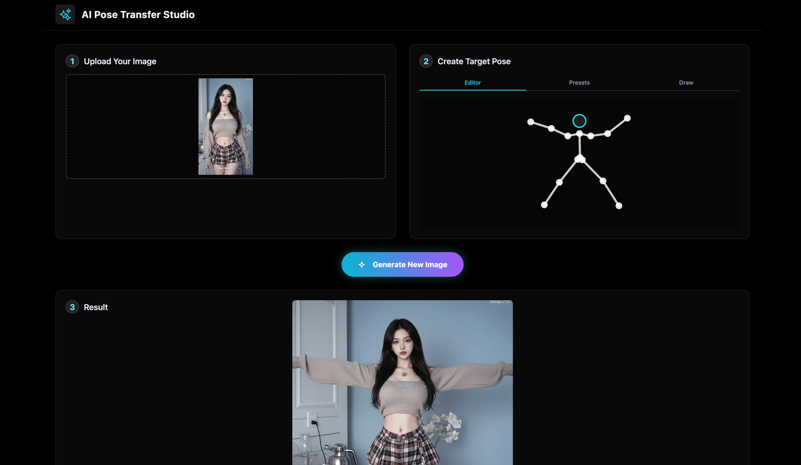

# 🎨｜AI Pose Transfer Studio｜姿态迁移工作室

基于 Gemini AI 的智能姿态迁移平台 - 让照片中的人物摆出你想要的姿势



## ✨ 核心功能

### 🎯 三种姿态创建模式
- **智能编辑器**：通过关节点精确控制人体姿态
- **预设姿态库**：丰富的预设动作，一键应用
- **自由绘制**：手绘火柴人姿态，创意无限

### 🚀 AI 驱动的姿态迁移
- 基于 Google Gemini 2.5 Flash 模型
- 智能识别人体结构和姿态
- 高质量图像生成和姿态转换

### 💎 现代化用户界面
- 响应式设计，支持多设备
- 毛玻璃效果和渐变动画
- 直观的三步操作流程

## 🎬 使用演示

### 基础操作流程
1. **上传照片** - 选择包含人物的图片
2. **创建姿态** - 使用三种模式之一设计目标姿势
3. **生成结果** - AI 自动完成姿态迁移


## 🛠️ 本地运行

**环境要求：** Node.js

1. 安装依赖：
   ```bash
   npm install
   ```

2. 配置 API 密钥：
   在项目根目录创建 `.env.local` 文件，并设置你的 Gemini API 密钥：
   ```
   VITE_GEMINI_API_KEY=your_actual_gemini_api_key_here
   ```
   ⚠️ **重要**：请将 `your_actual_gemini_api_key_here` 替换为你的实际 API 密钥

3. 启动应用（同时启动前端和代理服务器）：
   ```bash
   npm install
   npm run dev:full
   ```
   
   或者分别启动：
   ```bash
   # 终端 1：启动代理服务器
   npm run server
   
   # 终端 2：启动前端应用
   npm run dev
   ```

4. 在浏览器中访问：`http://localhost:5173`

## 🌐 在线体验

在 AI Studio 中查看应用：https://ai.studio/apps/drive/1nNLQWk7u2EZUERucQDK5g2MWgZ068MAR

## 📋 更新日志

* **2025-01-XX** - 项目创建
  - 实现三种姿态创建模式
  - 集成 Gemini AI 姿态迁移功能
  - 设计现代化 UI 界面

## 🎯 技术栈

- **前端框架**：React 19 + TypeScript
- **构建工具**：Vite
- **AI 模型**：Google Gemini 2.5 Flash
- **样式**：Tailwind CSS
- **图像处理**：Canvas API

## 📸 界面预览

### 主界面


## 🤝 贡献

欢迎提交 Issue 和 Pull Request 来改进这个项目！

## 📄 许可证

本项目基于 MIT 许可证开源。

## 👨‍💻 关于我 | About Me

📬 **联系我**：
* 邮箱：mapleshaw@gmail.com

🔗 **社交媒体**：
* X (Twitter)：[我的 Twitter](https://x.com/msjiaozhu)
* 小红书：[我的小红书主页](https://www.xiaohongshu.com/user/profile/5cb093ee0000000016005942)

💡 **支持我**：
* 如果这个项目对你有帮助，欢迎给个 ⭐ Star！
* 欢迎关注我的社交媒体获取更多 AI 项目更新

## 🙏 致谢

- Google Gemini AI 提供强大的图像生成能力
- React 和 Vite 提供优秀的开发体验
- 所有为开源社区做出贡献的开发者们
